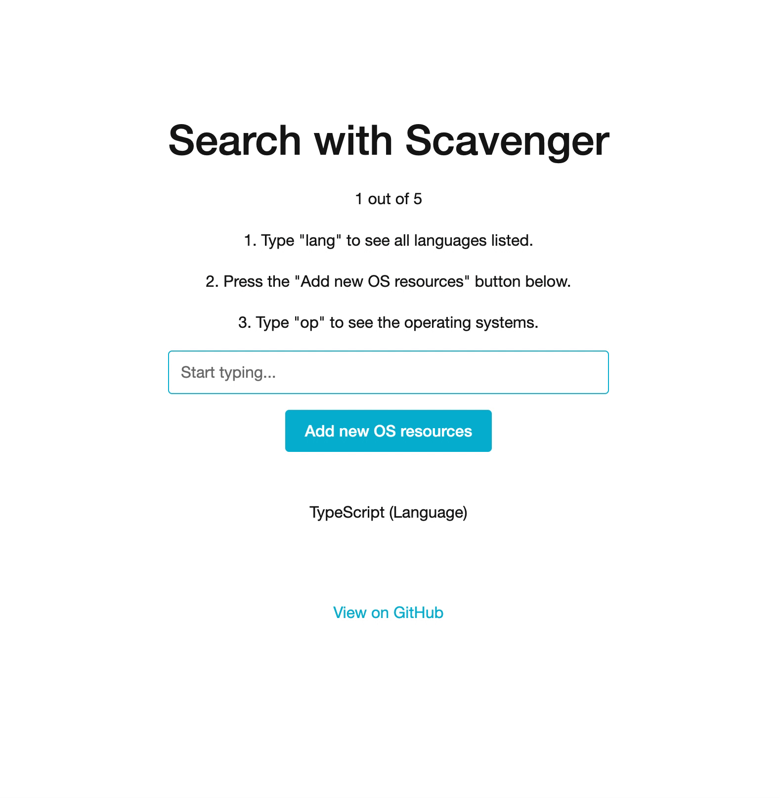

# Scavenger

⚡️ A lightning-fast static resource search library for React



## Features

- Initially populate searchable resources and/or add some on-the-fly.
- Display a static list of suggestions when the query is empty.
- Hook right into an input's value state and get instant results.
- Declare Schemas for your data so that only certain properties are searchable.
- Create multiple search components that all hook into the same resource pool.
- Search within nested data types.

**Note:** FAQs are at the end of this document.

## Installation

```bash
yarn add @infinium/scavenger
```

or

```bash
npm install @infinium/scavenger
```

## Basic Understanding

Scavenger doesn't work like Google or other search engines. The suggestions are derived from **static** resources. That is, no HTTP requests are made. This is what gives Scavenger the ability to be so-called "lightning-fast."

Don't worry, you don't have to know ahead-of-time all of your searchable resources. Indeed, the "Features" section spoke of adding resources on-the-fly.

## Understanding Terms

Just to give you an idea of what I'm talking about, here's a brief explanation of the terms I use to describe certain types of data.

**Resources** are JavaScript objects that must contain, at minimum, a property `type` (this can be changed). These are the "searchable" resources. They could be, for instance, User objects or Article objects. They're just the data you want searched. They must be an object, however.

A **resource pool** is just an array of resources.

**Schemas** are JavaScript objects, too, but they declare searchable properties that exist on **Resources.** That is, if you don't want to make the `id` of a **Resource** searchable, you **won't** put it into the **Schema**.

(In reality, you only ever declare one Schema, but it itself declares properties for multiple types of objects. That is, you can have Searchable articles separated from searchable pages.)

## Usage at a Glance

1. Create Schemas that define searchable properties in your data.
2. Load static and/or dynamic resources to be searched at any point in time.
3. Display the results with a React hook.

## Understanding vs. Boilerplate Code

The README contains the knowledge you'll need to use Scavenger properly. Before doing anything else, you should read it entirely.

If you've already read it and just want drop-in boilerplate code, visit the [wiki.](https://codeberg.org/athena/Scavenger/wiki)

## Documentation

To learn how to use Scavenger, go through the [interactive documentation found at this Sandbox.](https://codesandbox.io/s/scavenger-nzxwu) If you're not into CodeSandbox, you can view the `example/` directory; it's the same thing, just more hassle to set up.

If you're more keen on traditional API documentation, keep reading.

### `ScavengerProvider`

Scavenger needs to keep track of all of your resources across different hook instances. To do this, Scavenger exports a provider which will wrap your application and give the `useScavenger` hook the context it needs to operate.

The provider accepts a few parameters, all of which are explained here:

#### `initialResources: any[]`

This is an array of JS objects that act as your initial array of static resources. At minimum, each object needs to have a `type` property that is equal to the name of the Schema object you use. For instance, in the example, the type is `Language`.

It's not required to pass anything here.

#### `suggestions: any[]`

This is an array of objects that are suggested when the query is an empty string. If left empty, this will default to your `initialResources`.

#### `schema: Schema`

This is the primary Schema object that declares the type of all searchable resources, and what properties to search for from within those objects.

Note: It's standard practice to capitalize Schema types.

Let's look at an example. Assume we have the following data:

```js
const resources = [
    {
        id: 'a76ed3a5-9ed9-46e3-a67c-fbdac6035c20',
        auth_token: 'ffa4ddf73fb1cd262e5f252b25983898b3c8cad34938af6fd2b11da4c5d6a026',
        type: 'User',
        username: 'sholmes',
        full_name: 'Sherlock Holmes',
        plan: 'premium',
    },
];
```

Right now, we want users to be able to search by `username` and `first_name`, but not `id`, `auth_token`, `plan`, or `type`.

To do this, we declare a Schema that defines the properties we want searchable.

Let's do that now.

```js
const Schema = {
    User: ['username', 'first_name'],
}
```

Great! Now all we have to do is make sure our data conforms to this Schema.

> What if I already have a `type` property in my objects?

Just map your data before adding it to Scavenger. Change `type` to `_type` for instance.

### `useScavenger(query: string, options: Options)`

This is the primary hook you'll be using.

Basic usage looks like:

```js
const [query, setQuery] = useState('');
const scavenger = useScavenger(query, {
    sortBy: 'name',
    scope: 'root',
});
```

### Parameters

The hook accepts two parameters: `query` and `options`.

Query is just a string used in the searching.

Options is an object with the following properties:

```js
interface Options {
    sortBy: string;
    scope: string;
    id: string;
}
```

**`sortBy`** is the string name of a property on your objects that you want to sort by. For instance, you could sort by the title or description. It defaults to "name". The value attached to this property **must** be a string.

**`scope`** is the name of a Schema property that limits the search results to one specific type.

**`id`** is the property name that distinguishes some resources from others. This is the Schema type/property we're talking about. It defaults to `type`, which we recommend; if you must change it, you can.

This means that you can have one global search with scope `root`, and one inner search within your blog that only searches for resources of type `Article`.

It defaults to `root`, which is your entire resource pool.

### Returns

The returned object (`scavenger`) gives us a few things:

#### `results: any[]`

This is, as you'd expect, an array of the results returned from the search. It returns an array of objects that you passed in.

#### `loadResources(resources: any[], merge: boolean = true)`

This is a function that allows you to dynamically add resources to be searched. By default, resources are merged with the ones you initially passed into the provider, but this behavior can be disabled if you want to overwrite the resources.

```js
// This will merge the empty array with the
// initialResources you gave the provider.
scavenger.loadResources([]);

// This will overwrite the resources to an
// empty array.
scavenger.loadResources([], false);
```

#### `resources: any[]`

Just in case you need access to the entire array of resources, it's exported.

## FAQs

> How can I increase the relevancy of the results?

We're working on a more intelligent way to get search results that won't require direct modification of your data. In the meantime, the best way to make your results more accurate is to add more data to your resources.


The best way to do so is just to create properties with an array of tags that are all similar in some way to the primary object.

For instance, let's assume we have this Resource:

```js
const resource = {
    id: 'blahblahblah',
    title: 'Write Maintainable Code the First Time',
    description: "Maintainability is a major aspect of programming. Get it right and you'll be worry-free. Get it wrong, however...",
}
```

What if someone types "clean code" in your search area? Well, it won't be found, because that doesn't exist on the resource. What you can do to compensate for this is add some other helper properties to the resource that make the vector of discovery much wider.

Compare the above resource to:

```js
const resource = {
    id: 'blahblahblah',
    title: 'Write Maintainable Code the First Time',
    description: "Maintainability is a major aspect of programming. Get it right and you'll be worry-free. Get it wrong, however...",
    tags: ['clean code', 'good code', 'code'],
}
```

Assuming we add `tags` to our Schema, now the resource will be found for more queries.


## License

This project is licensed under the terms of the MIT license.

Copyright 2022-present Infinium LLC. All rights reserved.
